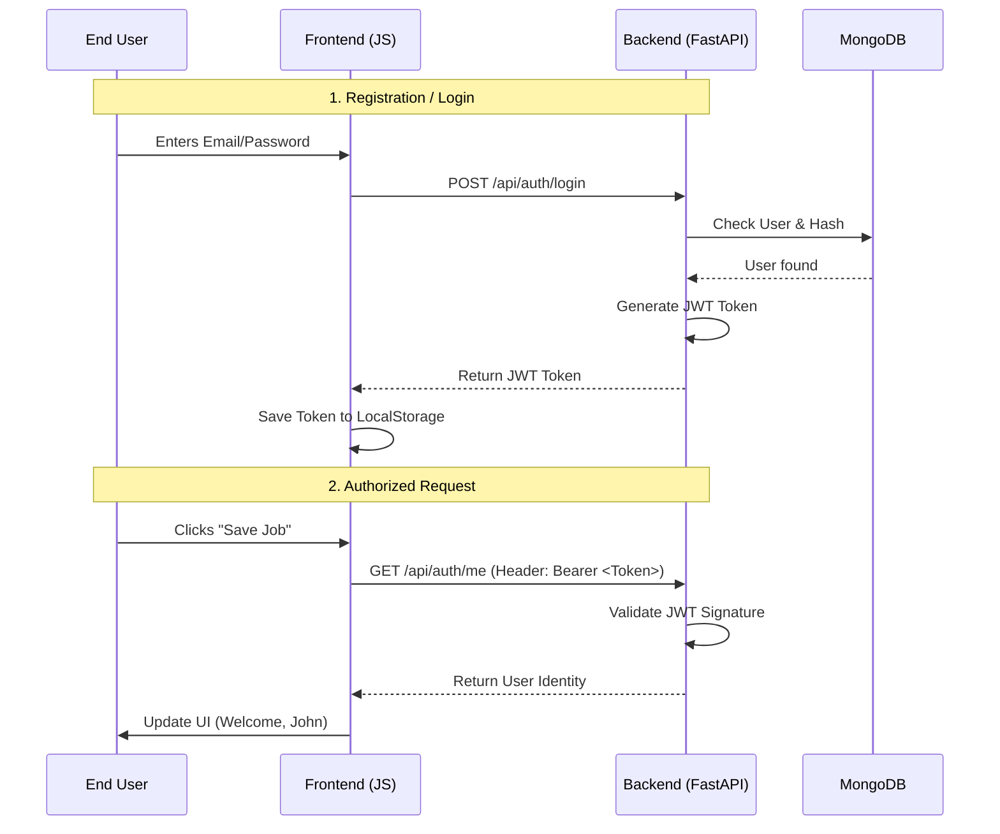
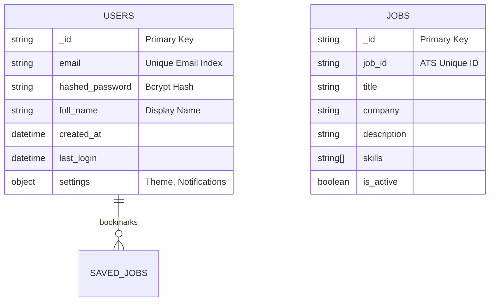

# User Authentication Scheme (JWT + Email/Password)

## 1. Overview
Secure user authentication for JobDetector to enable personalized features. Using a stateless JWT-based approach compatible with Vercel Serverless Functions.

### Authentication Flow


## 2. Technical Stack
- **Backend**: FastAPI (Python)
- **Security**: `passlib` (bcrypt) for password hashing
- **Session**: `PyJWT` for JSON Web Tokens
- **Database**: MongoDB (User collection)
- **Frontend**: Vanilla JS (LocalStorage + Bearer Token)

## 3. User Data Model (MongoDB)

### Schema Diagram


```json
{
  "email": "user@example.com",
  "hashed_password": "$2b$12$...",
  "full_name": "John Doe",
  "created_at": "2026-02-04T22:38:05Z",
  "last_login": "2026-02-05T10:00:00Z",
  "settings": {
    "theme": "dark",
    "email_notifications": true
  }
}
```

## 4. API Endpoints
- `POST /api/auth/register`: Create a new user account.
- `POST /api/auth/login`: Authenticate and receive a JWT.
- `GET /api/auth/me`: Fetch current user info (requires Token).
- `POST /api/auth/logout`: Frontend clears local token (stateless).

## 5. Security Measures
- **Hashing**: NEVER store plain text passwords. Use bcrypt with salt.
- **Tokens**: JWTs will have a 7-day expiration.
- **CORS**: Restricted to permitted origins.
- **HTTP-Only Cookies (Future Upgrade)**: Currently using LocalStorage for simplicity in MVP, will upgrade to secure cookies for production banking-grade security.

---
*Created on: 2026-02-04*
