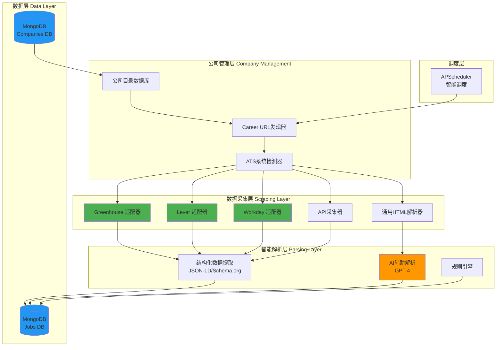
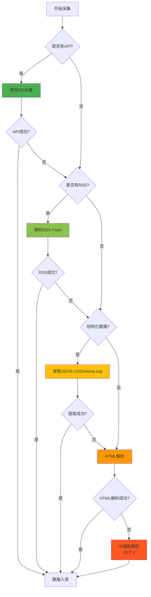

# JobDetector - 公司Career网站直采方案

> **设计理念**：直接从公司官方Career网站抓取职位信息，避免依赖LinkedIn/Indeed等三方平台

---

## 1. 方案概述

### 1.1 为什么这个方案更好？

| 维度 | LinkedIn/Indeed方案 | 公司直采方案 | 评估 |
|-----|-------------------|------------|------|
| **可靠性** | ⭐⭐ 容易被封IP/账号 | ⭐⭐⭐⭐⭐ 直接访问公开网站 | ✅ 更可靠 |
| **商业化风险** | ⭐ 违反ToS，有法律风险 | ⭐⭐⭐⭐⭐ 访问公开数据，合规 | ✅ 更安全 |
| **数据质量** | ⭐⭐⭐ 可能有延迟 | ⭐⭐⭐⭐⭐ 最新、最准确 | ✅ 更优质 |
| **维护成本** | ⭐⭐ 需要应对反爬虫 | ⭐⭐⭐ 网站结构相对稳定 | ≈ 相当 |
| **覆盖面** | ⭐⭐⭐⭐⭐ 所有公司 | ⭐⭐⭐ 需要手动添加公司 | ⚠️ 需要积累 |

**结论**：✅ **公司直采方案更适合长期发展和商业化**

### 1.2 核心挑战与解决方案

| 挑战 | 解决方案 |
|-----|---------|
| **如何获取公司列表？** | 1. 从现有数据源导入<br>2. 用户众包添加<br>3. 爬取公司目录网站 |
| **如何找到Career页面？** | 1. 通用模式识别（/careers, /jobs）<br>2. 使用搜索引擎API<br>3. 维护已知映射表 |
| **网站结构千差万别** | 1. 通用模板识别<br>2. 针对主流ATS系统（Greenhouse, Lever等）<br>3. AI辅助解析（GPT） |
| **数据提取准确性** | 1. 结构化数据优先（JSON-LD, Schema.org）<br>2. 多策略降级（API → RSS → HTML） |

---

## 2. 系统架构设计

### 2.1 整体架构



### 2.2 核心创新点

1. **ATS系统识别**：自动检测公司使用的招聘系统（Greenhouse, Lever, Workday等），使用对应的高效采集器
2. **多策略降级**：API → RSS Feed → 结构化数据 → HTML解析 → AI辅助
3. **智能调度**：根据公司更新频率动态调整抓取间隔
4. **众包维护**：用户可以提交新公司和修正解析规则

---

## 3. 公司目录管理

### 3.1 公司数据模型（MongoDB）

```javascript
// Collection: companies
{
  "_id": ObjectId("..."),
  "name": "Google",
  "domain": "google.com",
  "careers_url": "https://careers.google.com/jobs/results/",
  
  // ATS系统检测结果
  "ats_system": {
    "type": "custom",  // greenhouse, lever, workday, icims, jobvite, custom
    "detected_at": ISODate("2026-02-04T10:00:00Z"),
    "api_endpoint": "https://careers.google.com/api/v3/search/",  // 如果有
    "confidence": 0.95  // 检测置信度
  },
  
  // 爬取配置
  "scraper_config": {
    "method": "api",  // api, rss, html, structured_data
    "selectors": {  // HTML解析用
      "job_list": "div.job-listing",
      "title": "h3.job-title",
      "location": "span.location",
      // ...
    },
    "pagination": {
      "type": "infinite_scroll",  // pagination, infinite_scroll, load_more
      "max_pages": 10
    }
  },
  
  // 调度配置
  "schedule": {
    "frequency_hours": 12,  // 每12小时抓取一次
    "last_scraped_at": ISODate("2026-02-04T14:00:00Z"),
    "next_scrape_at": ISODate("2026-02-05T02:00:00Z"),
    "priority": 1  // 1-5，大公司优先级高
  },
  
  // 统计信息
  "stats": {
    "total_jobs_found": 1234,
    "active_jobs": 856,
    "avg_new_jobs_per_week": 45,
    "scrape_success_rate": 0.98,
    "last_error": null
  },
  
  // 元数据
  "metadata": {
    "industry": "Technology",
    "size": "10000+",
    "headquarters": "Mountain View, CA",
    "tags": ["FAANG", "AI", "Cloud"],
    "added_by": "admin",  // 或用户ID
    "added_at": ISODate("2026-01-01T00:00:00Z"),
    "verified": true
  },
  
  "is_active": true
}
```

### 3.2 如何获取公司列表？

#### 方案1：从现有数据源导入（推荐用于初始化）

**Fortune 500/1000公司**：
```python
# 使用现有公开数据
sources = [
    "https://github.com/datasets/fortune-500",  # Fortune 500
    "https://github.com/datasets/s-and-p-500-companies",  # S&P 500
    "https://github.com/public-apis/public-apis",  # 科技公司
]

# YC公司目录
yc_companies_api = "https://api.ycombinator.com/v0.1/companies"

# Crunchbase（需要API key，有免费额度）
crunchbase_api = "https://api.crunchbase.com/v4/entities/organizations"
```

**示例代码：**
```python
import requests
import pandas as pd

def import_companies_from_github():
    """从GitHub导入公开的公司列表"""
    # Fortune 500
    url = "https://raw.githubusercontent.com/datasets/fortune-500/master/data/fortune500.csv"
    df = pd.read_csv(url)
    
    companies = []
    for _, row in df.iterrows():
        company = {
            "name": row['Company'],
            "domain": guess_domain(row['Company']),  # 猜测域名
            "industry": row.get('Industry', ''),
            "size": "10000+",
            "tags": ["Fortune500"],
            "added_by": "system",
            "is_active": True
        }
        companies.append(company)
    
    return companies

def guess_domain(company_name: str) -> str:
    """根据公司名猜测域名"""
    # 简单规则
    name = company_name.lower()
    name = name.replace(' ', '').replace(',', '').replace('.', '')
    name = name.replace('inc', '').replace('corp', '').replace('llc', '')
    return f"{name}.com"
```

#### 方案2：爬取公司目录网站

**可用数据源**：
1. **Builtwith.com** - 按技术栈分类的公司
2. **AngelList/Wellfound** - 创业公司
3. **LinkedIn公司页面** - 仅抓取公司名和域名（不抓职位）
4. **Glassdoor公司目录**
5. **GitHub Organizations** - 科技公司

```python
# 示例：爬取YC公司
def scrape_yc_companies():
    """抓取Y Combinator公司列表"""
    url = "https://www.ycombinator.com/companies"
    # 使用Playwright抓取（动态加载）
    # 提取公司名、网站、行业等信息
    pass
```

#### 方案3：用户众包（长期维护）

**Web界面功能**：
```yaml
功能：
  - 用户提交新公司
  - 用户修正Career URL
  - 用户提交解析规则
  - 投票验证准确性

激励机制：
  - 贡献排行榜
  - 高质量贡献者获得高级功能
  - Gamification（徽章、积分）
```

---

## 4. Career网站发现与识别

### 4.1 Career URL发现策略

```python
class CareerUrlDiscovery:
    """Career页面URL发现器"""
    
    # 常见的Career页面路径模式
    COMMON_PATTERNS = [
        "/careers",
        "/jobs",
        "/career",
        "/join-us",
        "/work-with-us",
        "/opportunities",
        "/job-openings",
        "/employment",
        "/hiring",
        "/join",
        "/en/careers",  # 国际化
        "/company/careers",
    ]
    
    def discover_career_url(self, domain: str) -> dict:
        """
        发现公司的Career页面URL
        
        策略优先级：
        1. 检查常见路径模式
        2. 搜索引擎（Google Custom Search API）
        3. 网站地图（sitemap.xml）
        4. 主页链接分析
        """
        result = {
            "career_url": None,
            "method": None,
            "confidence": 0
        }
        
        # 策略1：尝试常见模式
        for pattern in self.COMMON_PATTERNS:
            url = f"https://{domain}{pattern}"
            if self.check_url_valid(url):
                result["career_url"] = url
                result["method"] = "pattern"
                result["confidence"] = 0.8
                return result
        
        # 策略2：Google搜索
        query = f"site:{domain} careers OR jobs"
        search_result = self.google_search(query)
        if search_result:
            result["career_url"] = search_result
            result["method"] = "search"
            result["confidence"] = 0.9
            return result
        
        # 策略3：分析sitemap
        sitemap_url = f"https://{domain}/sitemap.xml"
        career_url = self.parse_sitemap(sitemap_url)
        if career_url:
            result["career_url"] = career_url
            result["method"] = "sitemap"
            result["confidence"] = 0.85
            return result
        
        # 策略4：主页链接分析
        homepage_url = f"https://{domain}"
        career_url = self.analyze_homepage_links(homepage_url)
        if career_url:
            result["career_url"] = career_url
            result["method"] = "homepage"
            result["confidence"] = 0.7
        
        return result
    
    def check_url_valid(self, url: str) -> bool:
        """检查URL是否有效且是Career页面"""
        try:
            response = requests.head(url, timeout=5, allow_redirects=True)
            if response.status_code == 200:
                # 进一步验证：检查页面内容
                content = requests.get(url, timeout=5).text.lower()
                keywords = ['job', 'career', 'position', 'opening', 'hiring']
                return any(kw in content for kw in keywords)
        except:
            return False
        return False
    
    def google_search(self, query: str) -> str:
        """使用Google Custom Search API"""
        # 需要注册Google Custom Search API（免费100次/天）
        api_key = "YOUR_API_KEY"
        cx = "YOUR_SEARCH_ENGINE_ID"
        url = f"https://www.googleapis.com/customsearch/v1?key={api_key}&cx={cx}&q={query}"
        
        response = requests.get(url)
        results = response.json().get('items', [])
        if results:
            return results[0]['link']
        return None
```

### 4.2 ATS系统自动识别

**主流ATS系统特征**：

| ATS系统 | 市场份额 | URL模式 | API特征 | DOM特征 |
|---------|---------|---------|---------|---------|
| **Greenhouse** | ~30% | `boards.greenhouse.io` | `/embed/jobs` | `#application` |
| **Lever** | ~20% | `jobs.lever.co` | `/postings` | `.posting` |
| **Workday** | ~15% | `/jobs` | `myworkdayjobs.com` | `.jobProperty` |
| **iCIMS** | ~10% | `/jobs/intro` | `icims.com` | `.iCIMS_` |
| **Jobvite** | ~8% | `/jobs` | `jobvite.com` | `.jv-` |
| **SmartRecruiters** | ~5% | `/jobs` | `smartrecruiters.com` | `.opening-` |

```python
class ATSDetector:
    """ATS系统检测器"""
    
    ATS_SIGNATURES = {
        "greenhouse": {
            "url_patterns": [r"boards\.greenhouse\.io", r"grnh\.se"],
            "dom_markers": ["#application", ".opening"],
            "api_endpoint": "/embed/jobs"
        },
        "lever": {
            "url_patterns": [r"jobs\.lever\.co"],
            "dom_markers": [".posting", ".posting-headline"],
            "api_endpoint": "/postings"
        },
        "workday": {
            "url_patterns": [r"myworkdayjobs\.com"],
            "dom_markers": [".jobProperty", "workday"],
            "api_endpoint": None  # 通常无公开API
        },
        # ... 更多ATS系统
    }
    
    def detect_ats(self, career_url: str) -> dict:
        """
        检测Career页面使用的ATS系统
        
        Returns:
            {
                "type": "greenhouse",
                "confidence": 0.95,
                "api_endpoint": "https://...",
                "method": "url_pattern"  # url_pattern, dom_analysis, api_probe
            }
        """
        # 1. URL模式匹配
        for ats_name, signatures in self.ATS_SIGNATURES.items():
            for pattern in signatures["url_patterns"]:
                if re.search(pattern, career_url):
                    return {
                        "type": ats_name,
                        "confidence": 0.95,
                        "api_endpoint": self.construct_api_url(career_url, signatures),
                        "method": "url_pattern"
                    }
        
        # 2. DOM结构分析
        html = self.fetch_page(career_url)
        for ats_name, signatures in self.ATS_SIGNATURES.items():
            for marker in signatures["dom_markers"]:
                if marker in html:
                    return {
                        "type": ats_name,
                        "confidence": 0.85,
                        "api_endpoint": self.construct_api_url(career_url, signatures),
                        "method": "dom_analysis"
                    }
        
        # 3. API探测
        # ...
        
        return {
            "type": "custom",
            "confidence": 1.0,
            "api_endpoint": None,
            "method": "unknown"
        }
```

---

## 5. 数据采集策略

### 5.1 采集优先级（降级策略）



### 5.2 针对主流ATS的高效采集器

#### Greenhouse 采集器

```python
class GreenhouseScraper:
    """Greenhouse ATS 专用采集器"""
    
    def scrape(self, company_domain: str) -> list:
        """
        Greenhouse使用标准化的API
        URL: https://boards-api.greenhouse.io/v1/boards/{board_token}/jobs
        """
        # 1. 提取board_token
        board_token = self.extract_board_token(company_domain)
        
        # 2. 调用API
        api_url = f"https://boards-api.greenhouse.io/v1/boards/{board_token}/jobs"
        response = requests.get(api_url)
        
        if response.status_code != 200:
            return []
        
        jobs_data = response.json()
        jobs = []
        
        for job in jobs_data.get('jobs', []):
            jobs.append({
                "job_id": f"greenhouse_{job['id']}",
                "title": job['title'],
                "location": job.get('location', {}).get('name', ''),
                "description": self.clean_html(job.get('content', '')),
                "departments": [dept['name'] for dept in job.get('departments', [])],
                "source": "greenhouse",
                "source_url": job.get('absolute_url'),
                "posted_date": job.get('updated_at'),
                "raw_data": job
            })
        
        return jobs
    
    def extract_board_token(self, domain: str) -> str:
        """从公司网站提取Greenhouse board token"""
        career_url = f"https://{domain}/careers"
        html = requests.get(career_url).text
        
        # 查找嵌入的Greenhouse代码
        match = re.search(r'boards\.greenhouse\.io/embed/jobs\?for=(\w+)', html)
        if match:
            return match.group(1)
        
        # 或者直接从重定向URL提取
        # ...
        
        return None
```

#### Lever 采集器

```python
class LeverScraper:
    """Lever ATS 专用采集器"""
    
    def scrape(self, company_domain: str) -> list:
        """
        Lever也提供JSON API
        URL: https://api.lever.co/v0/postings/{company}?mode=json
        """
        company_slug = self.get_lever_slug(company_domain)
        
        api_url = f"https://api.lever.co/v0/postings/{company_slug}?mode=json"
        response = requests.get(api_url)
        
        jobs = []
        for job in response.json():
            jobs.append({
                "job_id": f"lever_{job['id']}",
                "title": job['text'],
                "location": job['categories'].get('location', ''),
                "description": self.clean_html(job['description']),
                "team": job['categories'].get('team', ''),
                "source": "lever",
                "source_url": job.get('hostedUrl'),
                "posted_date": job.get('createdAt'),
                "raw_data": job
            })
        
        return jobs
```

### 5.3 通用HTML解析器（Custom网站）

```python
class GenericJobScraper:
    """通用职位页面解析器"""
    
    def scrape(self, career_url: str, selectors: dict) -> list:
        """
        使用用户定义或AI推断的选择器解析HTML
        
        Args:
            career_url: Career页面URL
            selectors: CSS选择器配置
                {
                    "job_list": "div.job-item",
                    "title": "h3.title",
                    "location": "span.location",
                    ...
                }
        """
        from playwright.sync_api import sync_playwright
        
        jobs = []
        
        with sync_playwright() as p:
            browser = p.chromium.launch(headless=True)
            page = browser.new_page()
            page.goto(career_url)
            
            # 等待职位列表加载
            page.wait_for_selector(selectors['job_list'], timeout=10000)
            
            # 提取所有职位
            job_elements = page.query_selector_all(selectors['job_list'])
            
            for elem in job_elements:
                try:
                    job = {
                        "title": elem.query_selector(selectors['title']).inner_text(),
                        "location": elem.query_selector(selectors['location']).inner_text(),
                        "description": elem.query_selector(selectors.get('description', '')).inner_text(),
                        "source_url": elem.query_selector(selectors.get('link', 'a')).get_attribute('href'),
                    }
                    jobs.append(job)
                except Exception as e:
                    print(f"解析失败: {e}")
                    continue
            
            browser.close()
        
        return jobs
```

### 5.4 AI辅助解析（GPT-4）

当传统方法失败时，使用AI：

```python
class AIJobParser:
    """使用GPT-4解析职位页面"""
    
    def parse_with_ai(self, html_content: str, company_name: str) -> list:
        """
        使用GPT-4从HTML中提取职位信息
        """
        from openai import OpenAI
        
        client = OpenAI(api_key="YOUR_API_KEY")
        
        prompt = f"""
你是一个职位信息提取专家。请从以下HTML中提取所有职位信息。

公司名称: {company_name}

HTML内容:
{html_content[:4000]}  # 限制token数量

请以JSON数组格式返回，每个职位包含：
- title: 职位标题
- location: 工作地点
- description: 职位描述（简短摘要）
- url: 职位详情链接（相对或绝对路径）

示例输出:
[
  {{
    "title": "Senior Software Engineer",
    "location": "San Francisco, CA",
    "description": "We are looking for...",
    "url": "/careers/senior-swe"
  }}
]
"""
        
        response = client.chat.completions.create(
            model="gpt-4-turbo",
            messages=[{"role": "user", "content": prompt}],
            response_format={"type": "json_object"}
        )
        
        result = response.choices[0].message.content
        jobs = json.loads(result)
        
        return jobs
```

---

## 6. 数据质量保证

### 6.1 结构化数据优先（Schema.org）

许多Career页面包含结构化数据：

```python
def extract_structured_data(html: str) -> list:
    """提取JSON-LD结构化数据"""
    from bs4 import BeautifulSoup
    import json
    
    soup = BeautifulSoup(html, 'html.parser')
    jobs = []
    
    # 查找所有JSON-LD脚本
    scripts = soup.find_all('script', type='application/ld+json')
    
    for script in scripts:
        try:
            data = json.loads(script.string)
            
            # Schema.org JobPosting
            if data.get('@type') == 'JobPosting':
                job = {
                    "title": data.get('title'),
                    "description": data.get('description'),
                    "location": data.get('jobLocation', {}).get('address', {}).get('addressLocality'),
                    "salary": {
                        "min": data.get('baseSalary', {}).get('value', {}).get('minValue'),
                        "max": data.get('baseSalary', {}).get('value', {}).get('maxValue'),
                    },
                    "posted_date": data.get('datePosted'),
                    "employment_type": data.get('employmentType'),
                }
                jobs.append(job)
        except:
            continue
    
    return jobs
```

### 6.2 数据验证和清洗

```python
class JobDataValidator:
    """职位数据验证器"""
    
    REQUIRED_FIELDS = ['title', 'company', 'source_url']
    
    def validate(self, job: dict) -> bool:
        """验证职位数据完整性"""
        # 1. 必填字段检查
        for field in self.REQUIRED_FIELDS:
            if not job.get(field):
                return False
        
        # 2. 标题合理性检查
        if len(job['title']) < 3 or len(job['title']) > 200:
            return False
        
        # 3. URL有效性
        if not job['source_url'].startswith('http'):
            return False
        
        # 4. 去除明显的测试数据
        test_keywords = ['test', 'demo', 'sample', 'example']
        title_lower = job['title'].lower()
        if any(kw in title_lower for kw in test_keywords):
            return False
        
        return True
    
    def clean(self, job: dict) -> dict:
        """清洗职位数据"""
        # 清理HTML标签
        if job.get('description'):
            job['description'] = self.strip_html(job['description'])
        
        # 标准化地点格式
        if job.get('location'):
            job['location'] = self.normalize_location(job['location'])
        
        # 提取技能关键词
        job['skills'] = self.extract_skills(job.get('description', ''))
        
        return job
```

---

## 7. MVP实现方案

### 7.1 简化的MVP架构

**阶段1：手动维护公司列表**

```yaml
# companies.yaml（手动维护）
companies:
  - name: Google
    domain: google.com
    careers_url: https://careers.google.com/jobs/results/
    ats_type: custom
    
  - name: Netflix
    domain: netflix.com
    careers_url: https://jobs.netflix.com/
    ats_type: greenhouse
    board_token: netflix
    
  - name: Airbnb
    domain: airbnb.com
    careers_url: https://careers.airbnb.com/
    ats_type: greenhouse
    
  # ... 添加50-100家目标公司
```

**阶段2：使用预制的ATS采集器**

优先支持Greenhouse和Lever（覆盖~50%的科技公司）

```python
# main_company_direct.py
class CompanyDirectScraper:
    def __init__(self):
        self.companies = self.load_companies()
        self.scrapers = {
            'greenhouse': GreenhouseScraper(),
            'lever': LeverScraper(),
            'custom': GenericJobScraper()
        }
    
    def run(self):
        """运行抓取任务"""
        for company in self.companies:
            ats_type = company['ats_type']
            scraper = self.scrapers.get(ats_type)
            
            jobs = scraper.scrape(company)
            self.save_jobs(jobs, company['name'])
```

### 7.2 项目结构

```
JobDetector-CompanyDirect/
├── data/
│   └── companies.yaml          # 手动维护的公司列表
│
├── src/
│   ├── company_manager/
│   │   ├── discovery.py        # Career URL发现
│   │   ├── ats_detector.py     # ATS系统检测
│   │   └── validator.py        # 数据验证
│   │
│   ├── scrapers/
│   │   ├── greenhouse.py       # Greenhouse采集器
│   │   ├── lever.py            # Lever采集器
│   │   ├── workday.py          # Workday采集器
│   │   ├── generic.py          # 通用HTML解析
│   │   └── ai_parser.py        # AI辅助解析
│   │
│   ├── database/
│   │   ├── connection.py
│   │   └── models.py
│   │
│   └── main.py
│
└── scripts/
    ├── import_companies.py     # 批量导入公司
    ├── discover_careers.py     # 批量发现Career URL
    └── test_scraper.py
```

---

## 8. 优势与挑战

### 8.1 核心优势 ✅

1. **法律合规**
   - 访问公开网站，符合robots.txt
   - 不违反LinkedIn/Indeed的ToS
   - 商业化无风险

2. **数据质量**
   - 直接来源，最新最准确
   - 完整的职位描述
   - 官方联系方式

3. **可扩展性**
   - 标准化ATS系统易于维护
   - 可以添加无限公司
   - 社区贡献降低维护成本

4. **差异化**
   - 市面上大多数job board依赖聚合
   - 你的产品是"官方数据直达"

### 8.2 需要克服的挑战 ⚠️

1. **初期覆盖面有限**
   - 解决方案：聚焦特定行业（如科技）
   - 优先添加用户最关心的公司
   - 允许用户请求添加公司

2. **网站结构变化**
   - 解决方案：监控采集失败率
   - 自动告警 + 快速修复
   - ATS系统变化少，相对稳定

3. **反爬虫**
   - 解决方案：访问公开页面，速率控制
   - 使用代理池（如需要）
   - 优先使用API/RSS

---

## 9. 商业化路径

### 9.1 增值服务

1. **免费版**
   - 监控50家公司
   - 基础匹配
   - 邮件通知

2. **Pro版 ($9.99/月)**
   - 监控500+家公司
   - 高级匹配（AI评分）
   - 即时通知（Slack/Telegram）
   - 历史职位追踪

3. **Enterprise版 ($99/月)**
   - 自定义公司列表
   - API访问
   - 团队协作
   - 优先支持

### 9.2 数据产品

- 职位市场趋势报告
- 公司招聘健康度分析
- 技能需求预测

---

## 10. 开发优先级

### Phase 1: 核心MVP（2周）
- [x] 手动维护50家科技公司列表
- [ ] 实现Greenhouse采集器
- [ ] 实现Lever采集器
- [ ] 基础MongoDB存储
- [ ] 简单匹配 + 邮件通知

### Phase 2: 自动化（2周）
- [ ] Career URL自动发现
- [ ] ATS系统自动检测
- [ ] 通用HTML解析器
- [ ] 智能调度

### Phase 3: 规模化（4周）
- [ ] 支持500+公司
- [ ] 添加Workday等ATS
- [ ] AI辅助解析
- [ ] 用户添加公司功能
- [ ] Web界面

### Phase 4: 优化（持续）
- [ ] 性能优化
- [ ] 数据质量提升
- [ ] 社区贡献系统

---

## 11. 法律和伦理考虑

### 11.1 合规性检查清单

- ✅ **遵守robots.txt**：检查并遵守每个网站的爬虫规则
- ✅ **速率限制**：单个网站每小时<100请求
- ✅ **User-Agent标识**：明确标识为JobDetector爬虫
- ✅ **数据使用**：仅用于个人求职或内部使用
- ✅ **隐私保护**：不存储个人简历或联系信息
- ✅ **商业化透明**：明确告知数据来源

### 11.2 推荐的robots.txt检查

```python
from urllib.robotparser import RobotFileParser

def can_scrape(url: str) -> bool:
    """检查是否允许抓取"""
    rp = RobotFileParser()
    rp.set_url(f"{url.split('/')[0]}//{url.split('/')[2]}/robots.txt")
    rp.read()
    
    return rp.can_fetch("JobDetectorBot", url)
```

---

## 12. 总结

### 为什么公司直采方案是最佳选择？

1. ✅ **可持续性**：不依赖第三方平台，不怕被封
2. ✅ **数据质量**：官方来源，准确及时
3. ✅ **商业化友好**：合规，可扩展
4. ✅ **技术可行**：50%公司使用标准化ATS，易于采集
5. ✅ **差异化**：市场上独特的价值主张

### 下一步行动

1. **选择方案**：
   - 方案A：纯公司直采（本文档）
   - 方案B：LinkedIn/Indeed + 公司直采混合
   - 方案C：先从公司直采开始，后续评估

2. **开始开发**：
   - 创建50家目标公司列表
   - 实现Greenhouse采集器
   - 验证数据质量

您觉得这个方案如何？需要我帮您开始实现吗？
