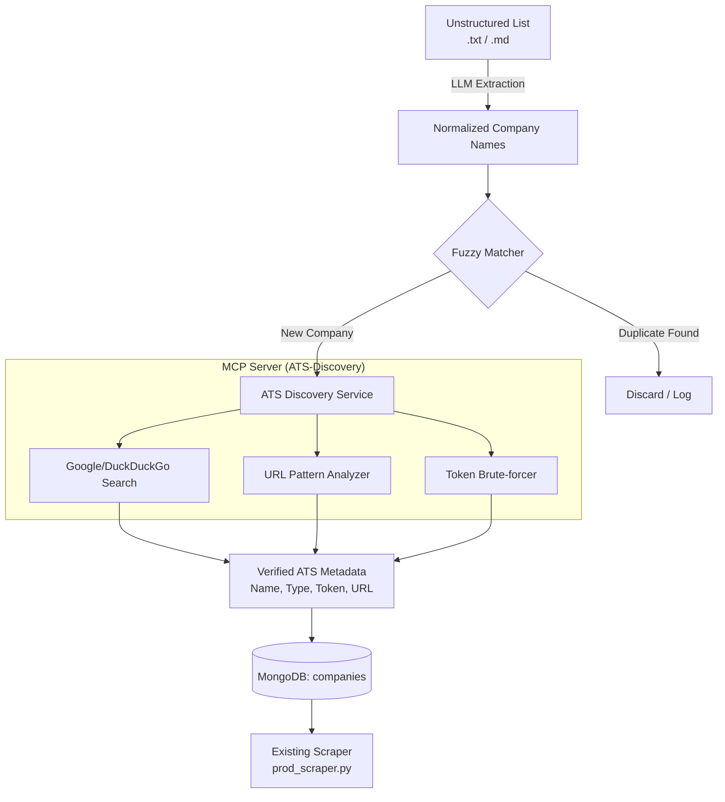

# Architecture Design: Company Discovery Pipeline

This document outlines the architecture for transforming unstructured company lists (like `data/ImportList/MidTechCompanies.txt`) into structured, verified data for the JobDetector scraper.

## 1. Overview
The pipeline follows a **Decoupled Three-Stage Architecture**:
1.  **AI Extraction**: Parsing raw text into normalized names.
2.  **Deduplication & Verification**: Comparing against existing DB with fuzzy matching.
3.  **ATS Discovery (MCP-based)**: Automatically finding the hiring platform (Greenhouse, Lever, etc.) for new companies.

## 2. System Architecture

## 3. Technology Stack

| Layer | Technology | Rationale |
| :--- | :--- | :--- |
| **Orchestration** | Python 3.11+ | Native support for scrapers and AI SDKs. |
| **Logic (AI)** | Anthropic Claude API | Superior at handling long, messy context and returning structured JSON. |
| **Discovery** | **MCP (Model Context Protocol)** | Encapsulates search and token detection as "tools" that can be reused by AI agents or the pipeline. |
| **Deduplication** | RapidFuzz | High-performance fuzzy string matching. |
| **Database** | MongoDB | Existing storage for `companies` and `jobs`. |
| **Search API** | DuckDuckGo-Search | Free, privacy-respecting search for discovering hiring URLs. |

## 4. Key Components

### 4.1 AI-Driven Extractor
A focused module that sends raw text to an LLM with a specific schema.
*   **Input**: `data/ImportList/*.txt`
*   **Output**: `[{ "name": "Stripe", "original": "1. Stripe" }, ...]`

### 4.2 MCP Server: `ats-discovery`
We will implement an MCP server that provides the following tools:
*   `search_company_careers(name)`: Returns potential careers page URLs.
*   `detect_ats_type(url)`: Analyzes HTML/URL patterns to identify if it's Greenhouse, Lever, Ashby, etc.
*   `extract_ats_token(url)`: Parses the unique handle/token from the URL.

### 4.3 Fuzzy Deduplicator
Uses Levenshtein distance to compare new names against the current DB.
*   **Score > 95**: Auto-merge.
*   **Score 85-95**: Flag for manual review in a daily report.

## 5. Production & Deployment

### 5.1 Is it Microservices?
Initially, this will be a **Modular Pipeline** within the existing codebase. However, it is designed to be **Microservice-Ready**:
*   The **MCP Server** can run as a standalone process (accessible via stdio or HTTP).
*   The **Ingestion Core** can run as a serverless function (Vercel Function) or a background worker.

### 5.2 Deployment Strategy
*   **Vercel Cron**: A daily job triggers the ingestion script.
*   **Dashboard**: Add a "Company Import Status" section to `admin_stats.html` to review "疑似重复" (Suspected Duplicates) and "Pending Discovery" results.
*   **Environment Variables**: Securely store `ANTHROPIC_API_KEY` and `SEARCH_API_KEY` in Vercel.

## 6. Future Considerations
*   **Self-Correction**: If a scraper fails multiple times, the pipeline should re-trigger ATS Discovery to see if the company changed platforms.
*   **Logo Extraction**: Integration with Clearbit or similar APIs to pull company logos during ingestion.
