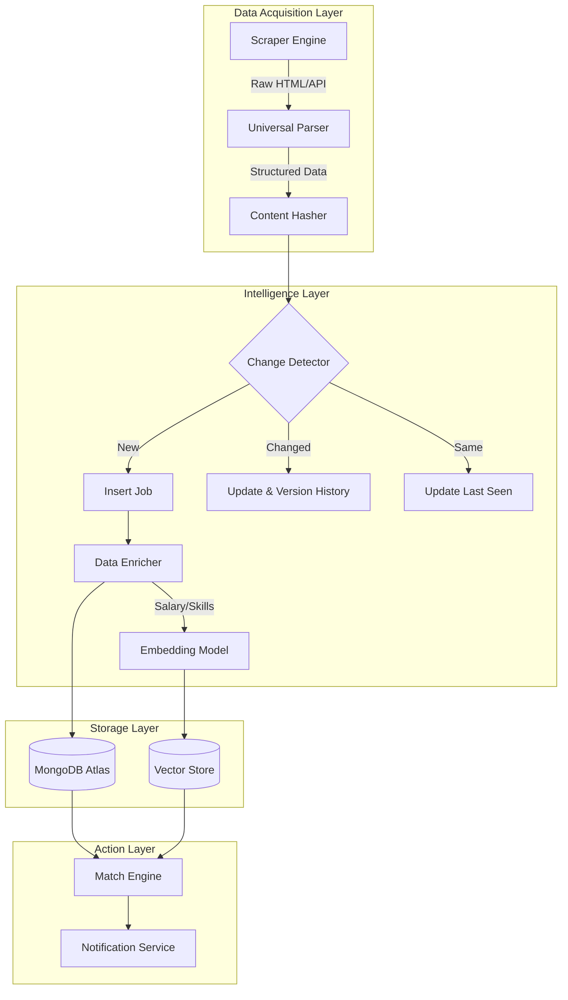

# Phase 2: Job Detector → Job Radar

> **Vision**: Move beyond a static job aggregator to a proactive **Change Detection & Intelligence Engine**.
> "Don't just list jobs. Tell me what changed, what's real, and what matches me."

---

## 1. Core Philosophy: The "Radar" Concept

| Feature | Old Way (Aggregator) | Phase 2 (Radar) |
| :--- | :--- | :--- |
| **Primary Action** | List current jobs | Monitor **changes** (New, Salary Update, Repost) |
| **Discovery** | User searches keywords | System **pushes** high-value matches |
| **Matching** | Boolean (Python AND Remote) | **Vector** (Skills, Seniority, Domain relevance) |
| **Quality** | Contains expired/ghost jobs | **Noise Filtering** (Ghost detection, Stale marking) |
| **Data Depth** | Title & Location | **Enriched** (Salary, Funding Series, Team Size) |

---

## 2. Key Features

### 📡 Change Detection Engine
Instead of just "is this job present?", we track the **lifecycle**:
- **New Drop**: Legitimately new ID detected.
- **Salary Bump**: Same legacy ID, but salary range increased.
- **Ghost Repost**: Same title/desc posted again within 7 days (mark as "Low Quality").
- **De-listed**: Job disappeared (mark as "Closed" or "Filled").

### 🧠 Semantic Matching (Vector Search)
- **User Profile**: "5 YOE, Python expert, prefers FinTech."
- **Job Embedding**: Create vector embeddings for job descriptions.
- **Match Score**: Calculate cosine similarity.
- **Benefit**: Matches "Backend Engineer" with "Server-side Developer" automatically.

### 🛡️ Noise & Ghost Filtering
- **Duplicate Detection**: Advanced content hashing (already started in Phase 1).
- **Stale Warning**: "This job has been open for 4+ months."
- **Repost Flag**: "This role is reposted every Monday."

### 📊 Data Enrichment
- **Salary Parser**: Regex/NLP extraction from descriptions (if not structured).
- **Company Intel**: Funding stage, Employee count trend (via API or manual tiering).

---

## 3. Architecture Design

---

## 4. Development Roadmap

### Sprint 1: Data Intelligence (The "Brain")
- [ ] **Salary Extraction**: Implement regex/LLM based salary parser for descriptions.
- [ ] **Skill Extractor**: Extract key tech stack tokens (e.g., "K8s", "Go", "React") into structured array.
- [ ] **Company Tiering**: Add `FundingStage` and `Size` fields to Company model.

### Sprint 2: Change Detection (The "Radar")
- [ ] **Version History**: Update Job model to track history of changes (e.g., salary changes).
- [ ] **Ghost Detector**: Logic to flag jobs reposted too frequently.
- [ ] **Staleness Logic**: Auto-archive jobs not seen in 3 scrapes.

### Sprint 3: Smart Matching (The "Match")
- [ ] **User Profile V2**: Add "Skills", "YOE", "Preferences" to User model.
- [ ] **Scoring Algo**: Implement a weighted scoring system (Keywords 40% + Location 30% + Salary 30%).
- [ ] **Dashboard Update**: "Recommended for You" section sorted by Score %.
