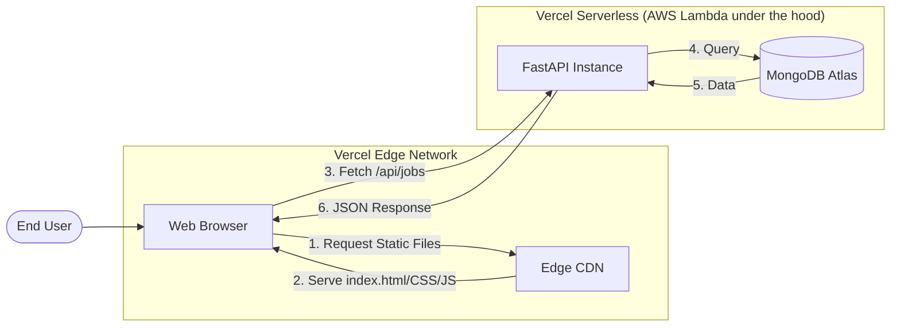

# JobDetector Web Architecture

This document explains the "Serverless Full-Stack" architecture used by JobDetector. This is a modern, high-performance, and cost-efficient way to build and scale web applications.

## 1. What is this architecture called?

This project follows the **JAMstack** philosophy using a **Single-Page Application (SPA)** frontend and a **Serverless API** backend.

- **JAMstack**: JavaScript, APIs, and Markup.
- **SPA**: A web application that interacts with the user by dynamically rewriting the current web page rather than loading entire new pages from a server.
- **Serverless Full-Stack**: The entire app (frontend and backend) is hosted on a cloud platform (Vercel) without managing physical servers.

## 2. Technical Stack

### Frontend (The "Look")
- **Framework**: **Vanilla JavaScript** (ES6+). No heavy frameworks like React/Vue were used to keep it lightweight and blazing fast.
- **Styling**: Modern CSS3 with **Glassmorphism** effects and CSS Grid/Flexbox for responsiveness.
- **Communication**: Uses the browser's native **Fetch API** to talk to the backend.

### Backend (The "Brain")
- **Framework**: **FastAPI**.
  - *Why FastAPI?* It is one of the fastest Python frameworks available, built on top of Starlette and Pydantic. It's asynchronous (ASGI) and uses Python type hints for validation.
- **Runtime**: **Vercel Serverless Functions**. The Python code only runs when an API request is made, saving resources and costs.

## 3. Visual Workflow

## 4. Key Advantages (How to explain to others)

1.  **Zero-Maintenance**: No servers to patch or update. Vercel handles the infrastructure.
2.  **Instant Scaling**: If 10,000 users visit the site at once, Vercel automatically spins up enough "Serverless Functions" to handle the load.
3.  **Performance**: Static assets are served from a CDN (Content Delivery Network) node closest to the user.
4.  **Developer Experience**: Integrated deployment (Git Push -> Live).

## 5. Directory Mapping
- `/index.html`, `/css`, `/js`: The **Static Frontend** (served by the Edge Network).
- `/api/index.py`: The **Dynamic Backend** (running as a Serverless Function).
- `/src`: The **Shared Logic** (used by both the local Scrapers and the Cloud API).
