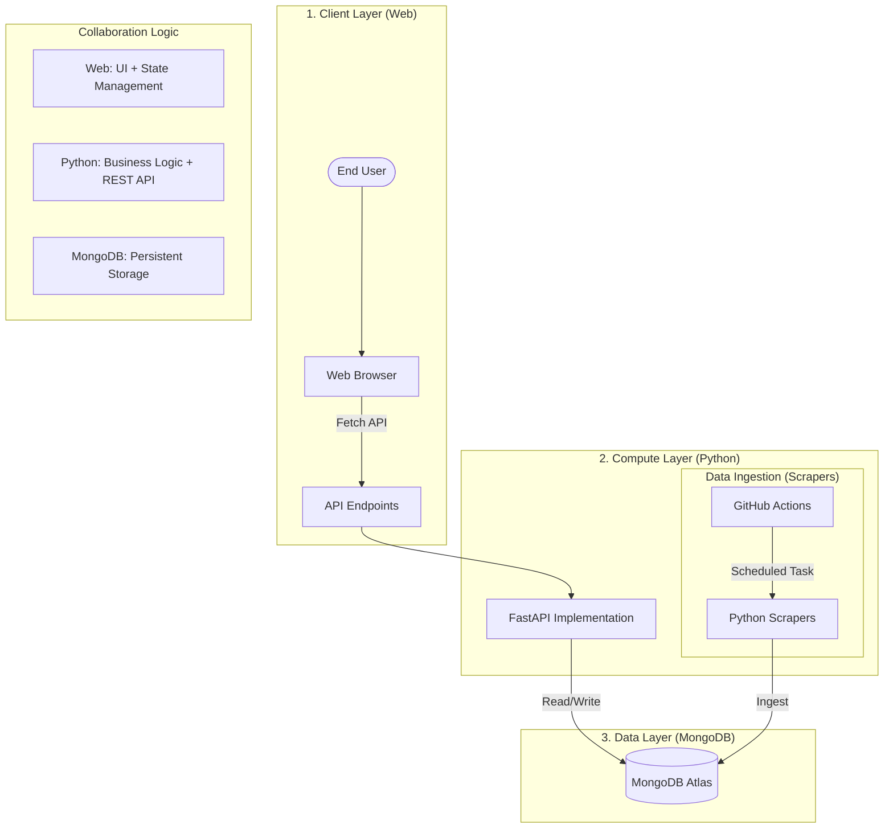

# JobDetector Web Architecture

This document explains the "Serverless Full-Stack" architecture used by JobDetector. This is a modern, high-performance, and cost-efficient way to build and scale web applications.

## 1. What is this architecture called?

This project follows the **JAMstack** philosophy using a **Single-Page Application (SPA)** frontend and a **Serverless API** backend.

- **JAMstack**: JavaScript, APIs, and Markup.
- **SPA**: A web application that interacts with the user by dynamically rewriting the current web page rather than loading entire new pages from a server.
- **Serverless Full-Stack**: The entire app (frontend and backend) is hosted on a cloud platform (Vercel) without managing physical servers.

## 2. Technical Stack

### Frontend (The "Look")
- **Framework**: **Vanilla JavaScript** (ES6+). No heavy frameworks like React/Vue were used to keep it lightweight and blazing fast.
- **Styling**: Modern CSS3 with **Glassmorphism** effects and CSS Grid/Flexbox for responsiveness.
- **Communication**: Uses the browser's native **Fetch API** to talk to the backend.

### Backend (The "Brain")
- **Framework**: **FastAPI**.
  - *Why FastAPI?* It is one of the fastest Python frameworks available, built on top of Starlette and Pydantic. It's asynchronous (ASGI) and uses Python type hints for validation.
- **Runtime**: **Vercel Serverless Functions**. The Python code only runs when an API request is made, saving resources and costs.

## 3. Visual Workflow & Collaboration

The system uses a **decoupled architecture** where data ingestion, data storage, and data serving are handled by different components.

### How They Work Together:
1.  **Web (Frontend)**: Vanilla JS handles URL routing, filtering, and job display. It requests data from the Python API and renders it without refreshing the page.
2.  **Python (Backend)**: 
    - **API Layer**: FastAPI runs on **Vercel Serverless Functions** (production) or **Uvicorn** (local). It validates tokens, handles job searches/favorites, and serves JSON to the frontend.
    - **Scraping Layer**: Python scripts run in **GitHub Actions** on a schedule (every 6 hours). They pull data from external sites, clean it, and push it directly to MongoDB.
3.  **MongoDB (Database)**: Acts as the "Source of Truth". Both the API and the Scrapers connect to it via `api/db.py` using the `MONGODB_URI`.

---

## 4. Components & Runners

| Component | Runner (Local) | Runner (Production) | Purpose |
|-----|-----|-----|-----|
| **Web Server** | `http-server` / Live Server | Vercel Static CDN | Serves HTML/CSS/JS |
| **API Backend** | `uvicorn api.index:app` | Vercel Serverless | Handles requests, Auth, DB queries |
| **Scrapers** | `python scripts/prod_scraper.py` | **GitHub Actions** | Periodically fetches new jobs |
| **Database** | Local Mongo / Atlas | **MongoDB Atlas** | Stores jobs, users, and stats |

## 4. Key Advantages (How to explain to others)

1.  **Zero-Maintenance**: No servers to patch or update. Vercel handles the infrastructure.
2.  **Instant Scaling**: If 10,000 users visit the site at once, Vercel automatically spins up enough "Serverless Functions" to handle the load.
3.  **Performance**: Static assets are served from a CDN (Content Delivery Network) node closest to the user.
4.  **Developer Experience**: Integrated deployment (Git Push -> Live).

## 5. Directory Mapping
- `/index.html`, `/css`, `/js`: The **Static Frontend** (served by the Edge Network).
- `/api/index.py`: The **Dynamic Backend** (running as a Serverless Function).
- `/src`: The **Shared Logic** (used by both the local Scrapers and the Cloud API).
