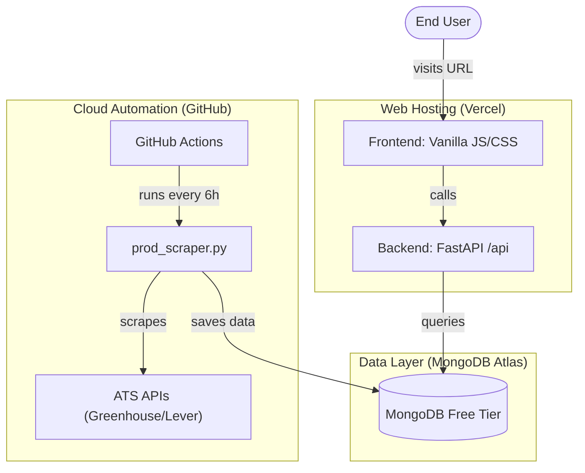

# JobDetector Production Deployment Guide

This guide documents the **Zero-Cost, Cloud-Native** deployment strategy for JobDetector. The architecture leverages GitHub Actions for automated scraping and Vercel for the Fullstack Dashboard.

## 1. Architecture Overview

### Visual Workflow


- **Storage**: MongoDB Atlas (Free M0 Cluster)
- **Automated Scraper**: GitHub Actions (Daily/Scheduled Cron)
- **Web Dashboard**: Vercel (FastAPI + Vanilla JS)
- **Infrastructure Cost**: **$0.00**

---

## 2. GitHub Actions (The Scraper Engine)

The scraper runs in a serverless environment on GitHub's infrastructure.

### Configuration
- **File**: `.github/workflows/scrape_jobs.yml`
- **Trigger**: Every 6 hours (`cron: '0 */6 * * *'`) or manual trigger.
- **Secrets Required**:
  - `MONGODB_URI`: Your MongoDB connection string.
  - `MONGODB_DATABASE`: Your database name (default: `JobDetector`).

### Manual Trigger
1. Go to your GitHub Repository.
2. Click **Actions** -> **Scheduled Job Scrape**.
3. Click **Run workflow**.

---

## 3. Vercel (The Dashboard & API)

Vercel hosts the frontend static files and the FastAPI backend as Serverless Functions.

### Structure
- **Frontend**: Root level (`index.html`, `css/`, `js/`).
- **Backend API**: `api/index.py` (FastAPI Entry point).

### Deployment Steps
1. Push code to GitHub.
2. Link the repository in [Vercel](https://vercel.com).
3. Select **FastAPI** as the Framework Preset.
4. Add **Environment Variables**:
   - `MONGODB_URI`
   - `MONGODB_DATABASE`
5. Deploy.

---

## 4. Custom Domain Setup

To use your own domain (e.g., `jobs.yourdomain.com`):

1. In Vercel Project: **Settings** -> **Domains**.
2. Add your domain.
3. Configure your DNS provider:
   - For subdomains: Create a **CNAME** record pointing to `cname.vercel-dns.com`.
   - For root domains: Create an **A** record pointing to `76.76.21.21`.
4. Vercel will automatically provision an SSL certificate once DNS propagates.

---

## 5. Maintenance & Monitoring

- **Logs (Scraper)**: Check GitHub **Actions** tab.
- **Logs (Web)**: Check Vercel **Logs** tab.
- **Database**: Monitor via MongoDB Atlas Cloud Console.
- **Rate Limiting**: Scrapers include a 2-second sleep between companies to remain polite and avoid IP bans.

---

## 6. Local Development
To run the dashboard locally:
```bash
python api/index.py
```
Access at: `http://localhost:8123`
